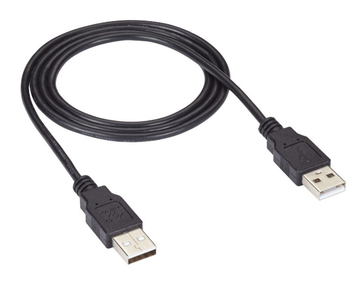
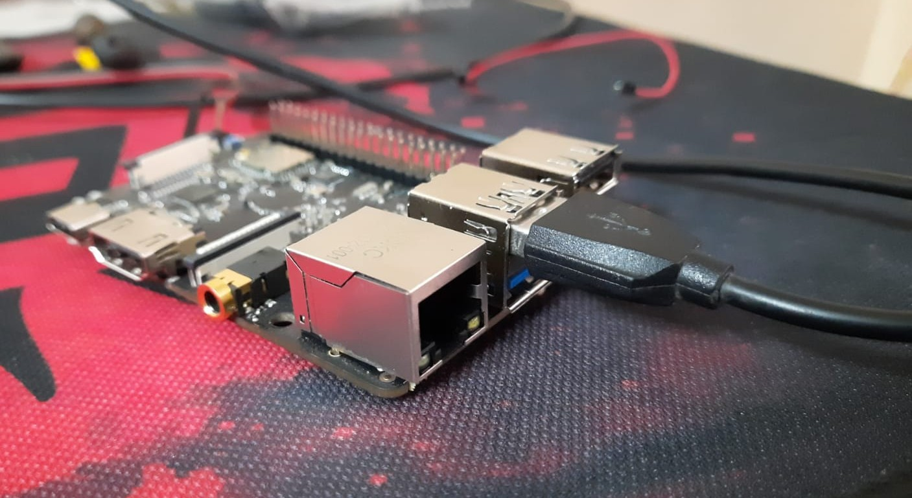
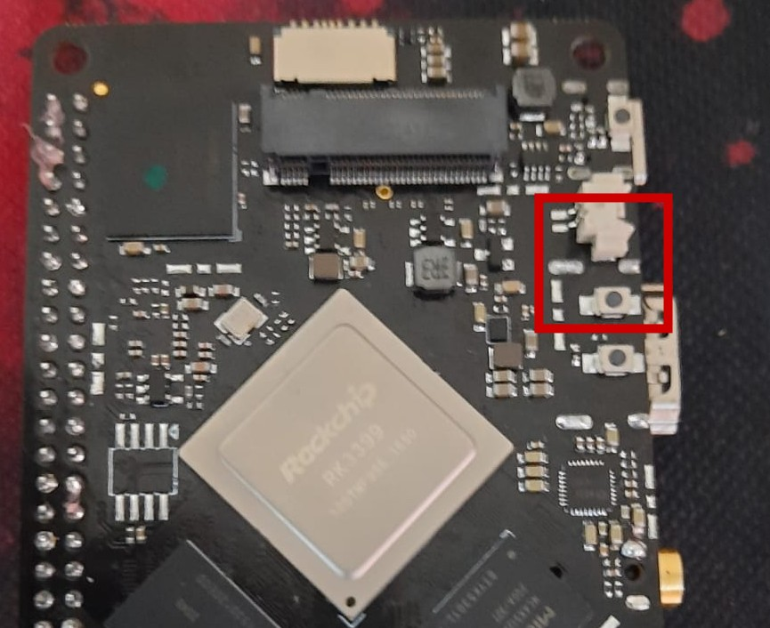
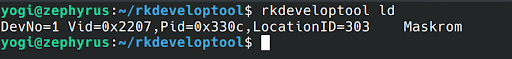

# Flashing Android to eMMC for Ubuntu Users

## Hardware Requirements
1. BrainyPi/Brainy Pro v1.0
2. Laptop/PC with Ubuntu 20.04 
3. USB 5V 3A Power Supply 
4. USB Type C cable 
5. USB Male A to Male A cable
   

## Overview 
Flashing Android to Brainy Pi is done in 3 easy steps 

1.  Download Android OS
2.  Boot Brainy Pi into MaskRom Mode
3.  Flash Android to Brainy Pi

## 1. Download Android OS 

-   Download latest Android OS release from [link]()
-   Extract the downloaded zip file. 

### 1a. Installing Tools and Drivers 

1. Extracted zip file should contain files and folders as given below
   ```
   .
   ├── brainypi-recovery.img
   ├── brainypi-recovery.img.info
   ├── FlashingGuide-Windows.pdf
   ├── FlashingGuide-Linux.pdf
   ├── md5sum.md5
   ├── ReleaseNotes.md
   ├── rk3399_loader_v1.20.119.bin
   └── tools
      ├── Linux
      │   └── rkdeveloptool-v1.32.zip
      └── Windows
          ├── DriverAssitant_v5.0.zip
          └── RKDevTool_Release_v2.81.zip
   ```

1. Navigate to tools —-> Linux folder.
2. Extract the file rkdeveloptool-v1.32.zip
3. Navigate to folder rkdeveloptool and Open a new Terminal in the folder. 
4. Run these commands given below to compile and Install rkdeveloptool 
   ```sh
   sudo apt-get install libudev-dev libusb-1.0-0-dev dh-autoreconf
   aclocal
   autoreconf -i
   autoheader
   automake --add-missing
   ./configure
   make
   sudo cp -arv ./rkdeveloptool /usr/bin/rkdeveloptool
   ```
5. Check if the tool was installed successfully.
   ```sh
   rkdeveloptool -v
   ```    


## 2. Boot BrainyPi into MaskRom mode

1. Power off the board & Remove microSD card (if inserted before). 
1. Connect USB Male A to Male A cable to Board’s Top USB 3.0 slot and Laptop/PC.
   
1. Press and hold the Maskrom key on the backside of the Board & Power on the board. 
   
1. Release the Maskrom key. (Important to release the key)

## 3. Flash Android to Brainy Pi

1. On your Laptop/PC, Open new Terminal
2. Run the command `rkdeveloptool ld` it should show the board connected
   
3. Download the loader into eMMC by running the command
   ```sh
   rkdeveloptool db rk3399_loader_v1.20.119.bin
   ```
4. Download the GPT image to eMMC, by running the command 
   ```sh
   rkdeveloptool wl 0 brainypi-android11-gpt.img
   ```
5. Reboot the device by running the command 
   ```sh
   rkdeveloptool rd
   ```
6. Now the device should boot to Android 
