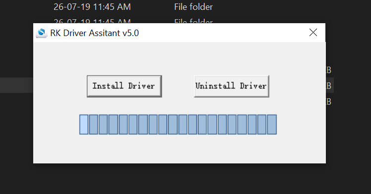
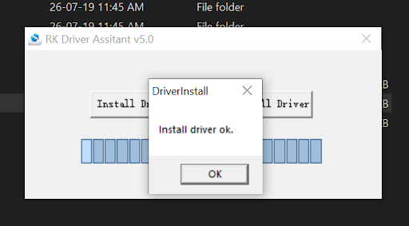
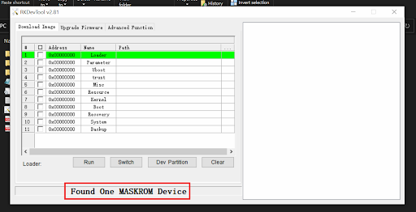
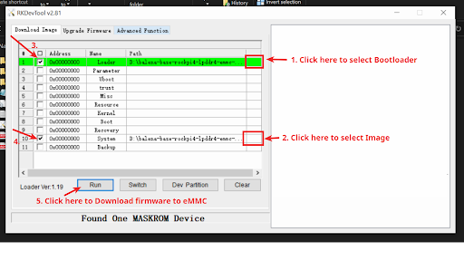
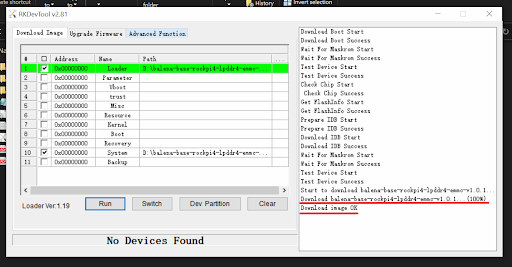

# Flashing Android to eMMC for Windows Users

## Hardware Requirements
1. BrainyPi/Brainy Pro v1.0
2. Laptop/PC
3. USB 5V 3A Power Supply 
4. USB Type C cable 
5. USB Male A to Male A cable
   

## Overview 
Flashing Android to Brainy Pi is done in 3 easy steps 

1.  Download Android OS
2.  Boot Brainy Pi into MaskRom Mode
3.  Flash Android to Brainy Pi

## 1. Download Android OS 

-   Download latest Android OS release from [link](https://github.com/brainypi/android-releases/releases/latest/download/brainypi-android11-22.12.10.zip)
-   Extract the downloaded zip file. 

### 1a. Installing Tools and Drivers 

1. Extracted zip file should contain files and folders as given below
   ```
   .
   ├── brainypi-recovery.img
   ├── brainypi-recovery.img.info
   ├── FlashingGuide-Windows.pdf
   ├── FlashingGuide-Linux.pdf
   ├── md5sum.md5
   ├── ReleaseNotes.md
   ├── rk3399_loader_v1.20.119.bin
   └── tools
      ├── Linux
      │   └── rkdeveloptool-v1.32.zip
      └── Windows
          ├── DriverAssitant_v5.0.zip
          └── RKDevTool_Release_v2.81.zip
   ```

1. Navigate to `tools —-> Windows` folder.  
1. Extract the files RKDevTool_Release_v2.81.zip and DriverAssitant_v5.0.zip
1. Navigate to the folder RKDevTool_Release_v2.81 and Install RKDevTool
1. Navigate to the folder DriverAssitant_v5.0 and Double Click DriverInstall and Click the Install Driver button.
      
1. Once the driver is installed it will give you a confirmation message. 
   

## 2. Boot BrainyPi into MaskRom mode

1. Power off the board & Remove microSD card (if inserted before). 
1. Connect USB Male A to Male A cable to Board’s Top USB 3.0 slot and Laptop/PC.
   
1. Press and hold the Maskrom key on the backside of the Board & Power on the board. 
   
1. Release the Maskrom key. (Important to release the key)
1. Open RKDevTool and Confirm that your board is in Maskrom mode, it will show Found one MASKROM Device.
     

## 3. Flash Android to Brainy Pi
1. Click the last column box for Loader. On the next prompt, Select the loader file "rk3399_loader_v1.20.119.bin"
   
1. Click the last column box for System. On the next prompt, Select the firmware “brainypi-android11-gpt.img"
1. Check the boxes in the 2nd column for row 1 and row 10.
1. Click the "Run" button. The tool will start downloading and you will see the download logs in the box on the right. 
1. Confirm if the Download was successful using the download log on the right box.  
   
1. Reboot the device and it should boot to Android 11.
